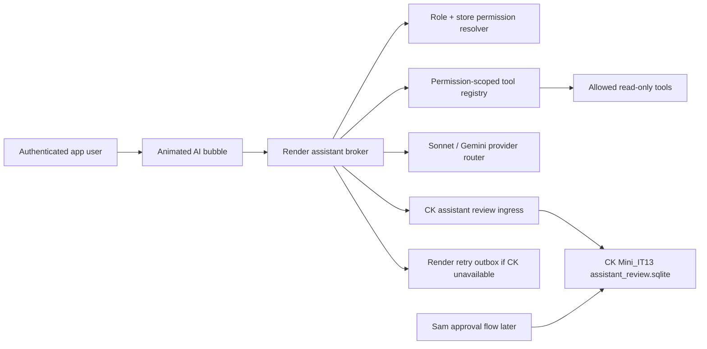

# Personalized AI Assistant Plan

## Target

Build a small animated assistant circle in the bottom-right of authenticated Cenas app pages. A user can ask questions, but the assistant must answer only from information that user is allowed to see by role, store scope, and session type.

The assistant is not a freeform backdoor. It is a permission-scoped answer engine with a tool registry, an audit trail, and a Sam approval queue for questions it cannot safely answer.

## Non-negotiables

- Role and store permissions come from the existing Cenas permission system.
- A partner, corporate user, GM, KM, expo, driver, and employee must receive different answers when their permissions differ.
- The model never decides its own permissions.
- Each data tool declares required permission tags, store scope rules, data class, and read/write class.
- The first production version is read-only.
- Any unanswered, blocked, or not-yet-approved question is saved with who asked, where they asked, their role/scope, and why the answer was blocked.
- The durable approval/question database belongs on CK/Mini_IT13.
- Render may host the web route and model broker, but CK is the authoritative storage point for unanswered-question review.
- Render should POST unanswered-question records to CK first. A Render retry outbox is only a non-authoritative fallback if CK is temporarily unreachable.
- Sonnet and Gemini are available now; OpenAI can be added later through the same provider router.

## Existing Primitives To Reuse

- `app/services/permissions.py`
  - `ROLE_PERMISSIONS`
  - `has_permission()`
  - `requires_permission()`
  - role tags like `ai.ask_claude`, `ai.ask_claude_personal`, `labor.*`, `orders.*`, `drivers.*`
- `app/web/permissions.py`
  - `accessible_store_slugs()`
  - `g.current_user`
  - `session.user_id`
- Existing non-manager session keys:
  - employee: `session.employee_id`
  - driver: `session.driver_id`
- Existing model patterns:
  - Anthropic/Sonnet plumbing in `app/web/sam_chat.py`
  - Gemini plumbing in `app/web/sam_chat.py`
- Existing CK-local data-center pattern:
  - Render exposes token-gated, field-whitelisted export endpoints.
  - CK pulls, stores, and derives durable marts locally.
  - Examples: `/cron/datamart-export`, `/cron/driverdc-export`

## Architecture



## Tool Registry Rules

Every assistant tool must have:

- `tool_id`
- `description`
- `required_permissions`
- `session_types`
- `store_scope`
- `data_class`
- `read_write_class`
- `allowed_roles`
- `deny_reason_if_missing`

Example:

```json
{
  "tool_id": "orders.store_summary",
  "required_permissions": ["orders.view"],
  "session_types": ["partner", "manager"],
  "store_scope": "current_user_store_scope",
  "data_class": "operations",
  "read_write_class": "read_only"
}
```

## Answer Policy

Answer directly only when:

- the current session is authenticated,
- the role has `ai.ask_claude_personal` or `ai.ask_claude`,
- every needed data tool is allowed for that role/session/store,
- the answer does not expose secrets, passcodes, tokens, raw customer PII, raw peer pay, unauthorized payroll, or cross-store data outside scope,
- the data source is implemented and current.

Save for Sam review when:

- the user asks for data their role cannot see,
- the requested tool is not built yet,
- the source is missing or stale,
- the question would require a write/action,
- the model is uncertain whether the answer is appropriate,
- the request asks for sensitive data.

## Initial Subagents

- `ContextLock`: confirms latest target and existing permission system.
- `PermissionMapper`: maps roles to assistant answer permissions.
- `ToolRegistryBuilder`: creates the read-only tool registry and denies unapproved tools.
- `BubbleUIBuilder`: builds the animated bottom-right circle and panel.
- `ModelRouter`: wires Sonnet/Gemini now and keeps OpenAI pluggable.
- `QuestionQueueBuilder`: stores blocked questions and exports them for CK.
- `CKDataCenterBuilder`: builds CK-local SQLite ingest for unanswered questions.
- `SafetyAuditor`: tests role boundaries and blocked question behavior.

## MVP Scope

1. Add assistant bubble to authenticated pages.
2. Add `/assistant/ask` broker endpoint.
3. Identify current principal: partner/corporate/manager/expo/driver/employee.
4. Permit only personal/general questions at first.
5. Block and save anything requiring private data tools not yet approved.
6. Add CK receiver `scripts/assistant_review_ck_receiver.py` for `POST /assistant/review-question`.
7. Configure Render `AI_ASSISTANT_CK_REVIEW_URL` and `AI_ASSISTANT_CK_REVIEW_TOKEN`.
8. Keep `/cron/assistant-questions-export` only as a retry-outbox inspection path, not the durable database.

## Current Build Status

- Assistant bubble CSS/JS is mounted from `base_dashboard.html`.
- `app/web/assistant_routes.py` is registered in `create_app()`.
- `/assistant/context` returns role/scope and the available assistant tool catalog.
- `/assistant/tools` exposes the permission-scoped tool registry for the current session.
- `/assistant/ask` answers only general-help questions for now; operational/data/sensitive questions are queued for Sam review.
- CK-local review DB exists at `C:\Users\sam\cena-ai-assistant\assistant_review.sqlite` with 7 privacy-preserving tables and 0 rows at creation.
- CK receiver draft is aligned to the actual CK schema: hashes/redacted summaries, principal hashes, risk level, delivery attempts, no raw tool payloads.
- CK receiver smoke passed on CK only: local bind `127.0.0.1:8778`, local restricted token, `/healthz` 200, one blocked-question POST saved hash/redacted proof rows, forbidden scan counts all 0, and no Render/prod/scheduler/notification/profile/link/data-tool activation.
- CK receiver contract is aligned locally: `POST /review/question`, status normalization to `needs_review` when needed, risk normalization to `blocked` when needed, and one per-POST row in question/principal/review-decision/model-audit/delivery-attempt tables.
- Render app config can use either the full review endpoint or the receiver base URL in `AI_ASSISTANT_CK_REVIEW_URL`; a base URL is normalized to `/review/question`.
- CK-compatible aliases are also accepted: `ASSISTANT_REVIEW_RECEIVER_URL`, `ASSISTANT_REVIEW_RECEIVER_TOKEN`, and `ASSISTANT_REVIEW_TIMEOUT_SECONDS`.
- Render-to-CK calls use `httpx` and honor `CENA_PROXY` when set, matching the existing Render userspace-Tailscale path for private CK/AiCk endpoints.
- Production exposure is feature-flagged: on Render, the assistant is disabled unless `AI_ASSISTANT_ENABLED=1` is set.
- Retry outbox records are redacted/hash-based instead of raw full records.
- Initial active tool: `assistant.general_help`.
- Review-gated tools: `employee.my_profile`, `orders.store_summary`, `drivers.store_summary`, `labor.store_aggregate`.
- CK receiver enablement test was completed by CK Codex on CK only. The receiver remains local/private; Render env/deploy is not configured yet.

## Enablement Gates

- Do not expose the CK receiver beyond the approved local/private bind.
- Do not paste or copy `AI_ASSISTANT_CK_REVIEW_TOKEN` or `ASSISTANT_REVIEW_TOKEN` into chat or repo files.
- Do not set `AI_ASSISTANT_ENABLED=1` on Render until the review receiver URL/token are set and verified.
- Do not configure Render `AI_ASSISTANT_CK_REVIEW_URL` / `AI_ASSISTANT_CK_REVIEW_TOKEN` or their `ASSISTANT_REVIEW_RECEIVER_*` aliases until the CK receiver proof passes and Sam approves the Render link. When approved, prefer a CK private/Tailscale receiver base URL or full `/review/question` URL; keep `CENA_PROXY` active for private-tailnet reachability; never put the token in the URL.
- Do not activate data tools until their role/store/scope policy and answer template are approved.
- Do not import driverdc export modules or read `DRIVERDC_HMAC_SALT`.
- Do not expose raw GPS, cleartext customer PII, passcodes, tokens, or raw peer pay/sales rows.

## Later Scope

- Sam approval UI.
- Approved-answer knowledge base.
- Full read-only tool registry.
- Role-specific retrieval from CK employee, driver, ezCater, schedule, roster, incident, and manager-log marts.
- OpenAI provider adapter.
- Manager alerts for unanswered operational questions.
